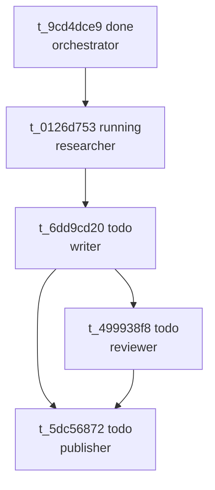

> 机制均来自本地源码（`hermes_cli/kanban_db.py`、`kanban_swarm.py`、`gateway/kanban_watchers.py`）与运行中 `blog` 看板实测，无虚构。标题 `v0.16` 按 researcher 清单属「待验证项」（未经源码/文档确认），机制本身均经实证。

## 一、为什么需要"看板蜂群"式多智能体协作

单 agent 适合小活，但任务变长、需分诊、要跨进程持久化或父进程崩溃后继续时，单 agent 力不从心。

Hermes 两种并行手段：`delegate_task` 与 Kanban Swarm。前者是**进程内**子 agent——隔离对话、独立 terminal，但父进程一退子任务就丢；受父循环时长约束（分钟级），并发默认仅 3。而 Swarm 的每个 worker 是**独立 OS 进程**（`hermes -p <profile>`），由常驻 dispatcher 按状态机调度，跨进程跨重启都在，任务图写进 SQLite 供任何人读写交接。研究分诊、定时运维、工程管线 decompose→并行 worktree→review→PR 这类长负载才该上 Swarm。dispatcher 本质是看板的看门狗：回收 stale、崩溃与 TTL 过期、原子 claim、再 spawn——单 agent 没有这套回收续跑机制。

**看板（Kanban）就是跨 profile 的共享协作原语**，是各角色对齐的「单一事实来源」，非某 agent 私有待办。

何时**不该**上 Swarm？任务十分钟跑完、不需人介入、不在乎崩溃重来，用 `delegate_task` 更轻。Swarm 代价是「工程化」：设计任务图、想清依赖边、长任务埋心跳。判断标准：**超进程生命周期？有人中途接手？崩了要续？** 任一为是就考虑 Swarm。

## 二、核心机制：共享数据库 + 状态机 + 调度循环

**1. 共享 SQLite。** 每看板是一目录 `<根>/kanban/boards/<slug>/kanban.db`，自带 `workspaces/`、`logs/`。`board` 是硬边界，worker 被钉死 `HERMES_KANBAN_BOARD`；`tenant` 仅为板内软命名空间（workspace 路径+memory key 隔离）。看板路径**不能**由 profile 的 `HERMES_HOME` 解析，否则按 profile 分裂、破坏 dispatcher/worker 交接。

**2. 状态机。** 合法状态 `triage, todo, scheduled, ready, running, blocked, review, done, archived`；合法**初始**仅 `running`/`blocked`，其余由生命周期转移产生。`kanban_create` 新卡默认落 `todo`，再经依赖门控升 `ready`。

**3. dispatcher 循环。** 内核 `dispatch_once`/`_dispatch_once_locked` 默认跑在 gateway 内。每 tick：回收 TTL 过期 stale running、回收无心跳的、回收崩溃的、promote `todo`→`ready`、对带 assignee 的 ready 任务原子 claim 并 spawn worker。

防两 dispatcher 抢同一 `kanban.db`，用基于 DB 路径的**单写文件锁**避 WAL 竞争。并发上限分两层：`max_spawn` 板级实时并发（任何时刻最多 N worker），`max_in_progress` 主机级跨 board 并发（worker 共享机器内存）。内存护栏：`critical` 本 tick 不 spawn（推迟非丢弃），`elevated` 本 tick 至多 1 worker；并预留 review 车道名额防 ready 饿死 review。

**两层门面同一内核**：模型经 `kanban_*` 工具、人类经 `hermes kanban` CLI/斜杠/dashboard，都走 `kanban_db` 层，视图一致、写入不漂移。故 Swarm 不引入第二调度器，直接写任务图进既有内核复用门控。`cronjob` 是定时调度器（duration/every/cron 触发，可链式多平台投递），`curator` 只维护 agent 创建的 skills（永不删，最破坏动作 archive），皆与看板调度正交。

## 三、多 profile 协作拓扑

每 profile 独立配置 `~/.hermes/profiles/<name>/`（skills/memory 隔离），`assignee` 字段定执行者，dispatcher 经 `hermes -p <assignee>` 拉起进程。

**依赖门控（parents）是拓扑灵魂。** 依赖边存 `task_links(parent_id, child_id)`，`recompute_ready()` 在所有父 `done`/`archived` 时把子从 `todo` 提 `ready`，形成 DAG——上游不完成下游不启动。

**未知 assignee 被静默丢弃**：派发前 `profile_exists(assignee)` 检查，非真实 profile 进 `skipped_nonspawnable` 列表**绝不 spawn**（防 "Profile does not exist" crash-loop）。故编排前先 `hermes profile list` 确认存在。

## 四、生命周期与交接

**心跳续期**：认领默认 15 分（`DEFAULT_CLAIM_TTL_SECONDS=900`）过期。长任务须周期 `kanban_heartbeat`；过期但 PID 存活则认领**延长**非回收（防慢模型超 TTL 误杀）。陈旧回收阈值 `_STALE_HEARTBEAT_GAP_SECONDS=3600`（1h）：超阈值且 1h 无心跳的 running 被回收 `stale` 并杀存活 worker。故**长任务 >1h 须每小时至少心跳一次**。

**四类阻塞**：`VALID_BLOCK_KINDS={dependency, needs_input, capability, transient}`。`dependency` 不进 human 阻塞桶，回 `todo` 等父门控；其余三类进 `blocked` 等人类。unblock 循环断路器 `BLOCK_RECURRENCE_LIMIT=2`：同原因反复阻塞 2 次改路由 `triage` 防 cron 自旋。

**完成交接**：`kanban_complete` 带结构化 handoff——`summary`/`metadata`（机器可读）/`created_cards`（本任务 create 子卡 id，内核校验存在且由本 worker 创建否则报错）/`artifacts`（绝对路径，网关上传为附件）。完成清失败计数并 `recompute_ready` 释放下游。失败断路器 `failure_limit` 默认 2，连败达限自动 block 带原因。这套 handoff 让任意 profile 接手时无需追问上下文：上游 summary 与 metadata 已是现成交接单。

**审计可追溯**：`task_runs` 是唯一尝试记录，每次 claim 加一行（状态含 running/done/blocked/crashed/timed_out/failed/released，outcome 含 completed/blocked/crashed/timed_out/spawn_failed/gave_up/reclaimed）。summary/metadata 挂 run 非 task，任务回收重试后历史仍可逐条追溯。实测 `t_9cd4dce9` 留 `done/orchestrator/completed`，`t_0126d753` 当时 `running/researcher`。

## 五、端到端实战：博客自动编写流水线

本任务即运行实例。看板任务图（已读 `kanban.db` 验证）：



逻辑：`orchestrator 拆解 → researcher 调研 → writer 写作 → reviewer 审稿 → publisher 发布`。**publisher 双门控**：父为 writer 与 reviewer，均 `done` 才发布已审定版——一条 `task_links` 依赖边实现自动门控。

> 上图为**写作时刻**快照：`t_0126d753` running，`t_6dd9cd20/t_499938f8/t_5dc56872` todo。截至发布部分卡已推进（调研/写作为 done、审稿 running、发布 todo），拓扑不变。

编排入口可调用 Swarm 助手：

```python
from hermes_cli import kanban_swarm as ks
ks.create_swarm(conn, goal="...",
    workers=[ks.SwarmWorkerSpec(...)],
    verifier_assignee="reviewer",     # parents=workers，强制 requesting-code-review
    synthesizer_assignee="publisher", # parents=verifier，默认 humanizer
)
```

`create_swarm` 原子创建：立即 `done` 的 planning root（共享黑板 blackboard+审计锚）、并行 worker、门控 verifier、收口 synthesizer。共享黑板低技术化——root 上结构化 JSON 评论（`[swarm:blackboard]` 前缀），dashboard/notifier/dispatcher 无需新服务。`idempotency_key` 重试安全。

人类侧直接 CLI 建卡：

```bash
hermes kanban init                              # 初始化看板
hermes kanban create "撰写 XXX" \
  --assignee writer --parent t_0126d753 --skill "blog-writing"
hermes kanban link  t_6dd9cd20 t_499938f8      # 建依赖边
hermes kanban show  t_6dd9cd20                 # 看完整状态(含 worker_context)
hermes kanban block t_6dd9cd20 --kind needs_input "等素材"
hermes kanban complete t_6dd9cd20              # 完成并释放下游
```

## 六、最佳实践与陷阱

- **assignee 必先存在**：未知 assignee 静默丢弃，卡永 `ready` 不动。编排前 `hermes profile list` 核实。
- **长任务必心跳**：>1h 每小时 `kanban_heartbeat`，否则回收 `stale`。
- **避免依赖环**：`task_links` 是 DAG，循环/自环被拒；勿同时写 A→B 与 B→A。
- **`created_cards` 不虚构**：必须是 `kanban_create` 真实返回 id，编造 id 在内核校验阻断完成。
- **`artifacts` 用绝对路径**：声明文件须磁盘存在，网关才上传。
- **worker 内勿用 `hermes kanban`**：应走注入的 `kanban_*` 工具集，非 shell 调 CLI。
- **失败计数拦 promote**：`consecutive_failures` 达上限，父完成也不自动 promote。卡 `todo` 不动先查 `task_runs` 失败次数。
- **`blocked` 分清来源**：仅 worker 主动 `kanban_block` 需显式 `kanban_unblock`；因父依赖未完的 `blocked` 父 `done` 时自动解除。

## 七、总结

Kanban Swarm 并非又一个花哨「多 agent 框架」，而是把**共享 SQLite 任务图 + 状态机 + 依赖门控 + 常驻 dispatcher** 作底盘：每 worker 是独立 OS 进程，持久、可重启、可审计；人类用 CLI、模型用工具集，皆走同一 `kanban_db` 层。当你要的不只是「跑完一次」而是「可靠跑完、崩了能续、谁都能接手」时，Swarm 把协作复杂度收进数据库一行行记录，而非某 agent 内存。其价值不在编排花哨，而在把「谁在做什么、做到哪、为何卡住」变成可查询、可交接、可重放的事实——这正是长链路 AI 工作流的工程化刚需。

> 官方文档：https://hermes-agent.nousresearch.com/docs/user-guide/features/kanban
